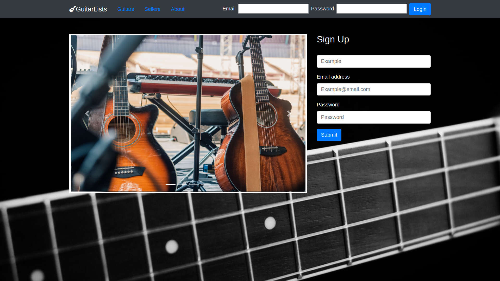

**GuitarLists** is an application built with React/Redux and Rails that allows users to view and email sellers about a guitar and create a post to sell guitars.



Submitted by: **Rafael Batista**


## Live Demo 
https://guitar-lists-client.herokuapp.com/  

The live demo does not yet have the changes and updates that this repo has.

## User Stories
\
The following functionality is complete:

* [x] User can create an account with username, email and password.
* [x] User can authenticate via email and password to access account.
* [x] User can view other users and guitars.
* [x] User can email a seller.
* [x] User can create a post to sell a guitar.
* [x] User can edit their post.
* [x] User can delete their post.

The following **additional** features are implemented:

- [ ] User can upload an avatar.
- [ ] User can upload images for the guitar being sold.
- [ ] User can login and sign up through Facebook.


## Video Walkthrough 

Here's a walkthrough of implemented user stories:

[](https://youtu.be/587dcE9-Cgo)

## Installation

To use this app, clone the repo. You need to install dependencies in the guitar-lists-api and guitar-lists-cli directory There are also tests you can run.

Set up server:
```sh
cd guitar-lists-api 
bundle install 
rspec
rails s
```

Set up client
```sh
cd guitar-lists-client 
npm test
npm install
```
